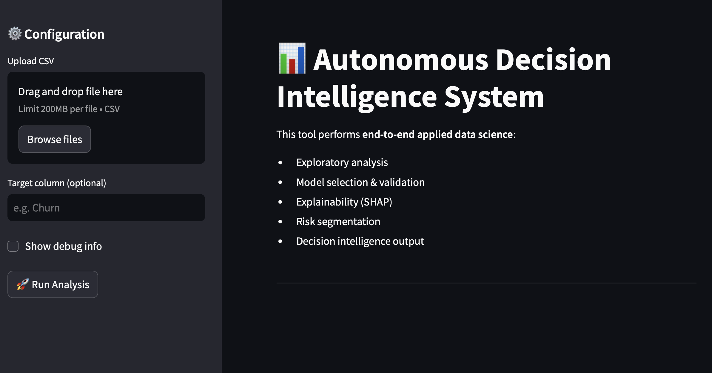
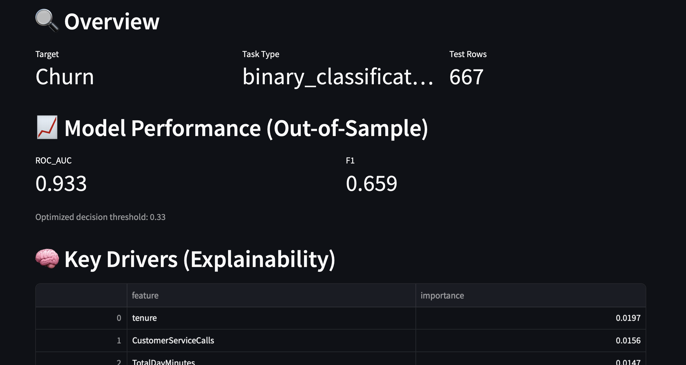

# Autonomous Decision Intelligence System (Bring-Your-Own-Dataset)

A Streamlit app + ML pipeline that runs end-to-end analysis on any tabular binary-classification dataset:
EDA → preprocessing → model selection → evaluation → explainability → risk segmentation → decision summary.

## Demo
- Upload a CSV
- Choose target column
- Get metrics + key drivers + segments + error clusters

## Tech Stack
Python, Pandas, scikit-learn, SHAP, MLflow (optional), Streamlit

## Features
- Automatic schema + task detection (classification/regression)
- Robust preprocessing (missing values, numeric/categorical)
- Model benchmarking + best model selection
- Out-of-sample evaluation metrics
- Explainability (global feature importance)
- Risk segmentation buckets
- Decision summary for business stakeholders





## Run Locally
```bash
git clone <your-repo-url>
cd decision-intelligence-system

python -m venv .venv
source .venv/bin/activate   # Windows: .venv\Scripts\activate

pip install -r requirements.txt
streamlit run ui/app.py
